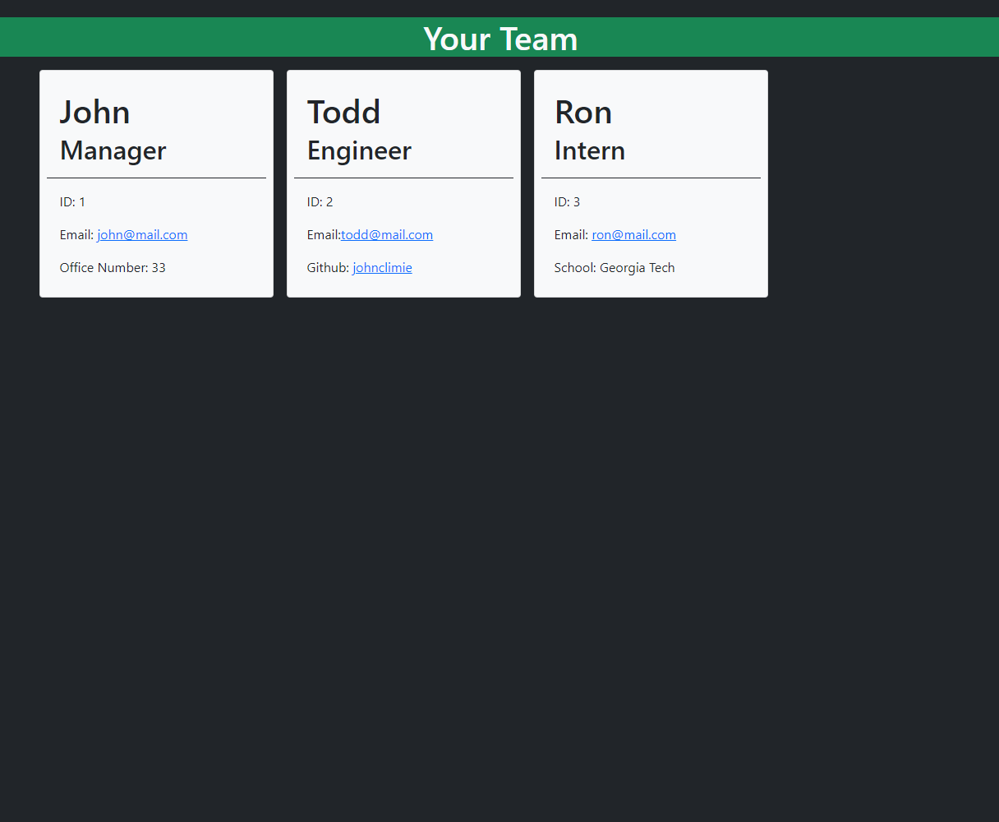

# Team Profile Generator

## Description

In this project, I created a Node.js application that takes user input and applies it to a new HTML file. This input is used to input information for a memeber for one's team.

The project takes an inital manager input, and then asks if the user would want to add an intern, engineer, or finish the project. Within each, they are asked to input name, id, email, etc. 

This project used Javascript, Node.js, along with NPMs such as Inquirer for prompting questions, FS for writing the HTML data to an HTML file, and JEST for testing the employee, intern, manager and engineer objects. 

Overall, I really enjoyed this project, as it provided a new challange to overcome, which was implementing objects into my code. I also had to find a way to have the funciton which asked if i wanted to add a new team member to repeat until 'Finish' was selcted.

**Link**

YouTube Demonstration: https://www.youtube.com/watch?v=kOyalXIZBe8